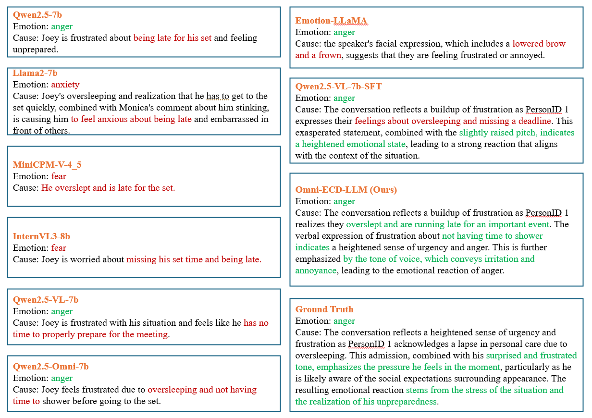

# Supplementary Figures for Anonymous Submission

## Figure 1. An example presents the full pipeline

## Figure 2. Qualitative comparison across models case 1

## Figure 3. Qualitative comparison across models case 2

